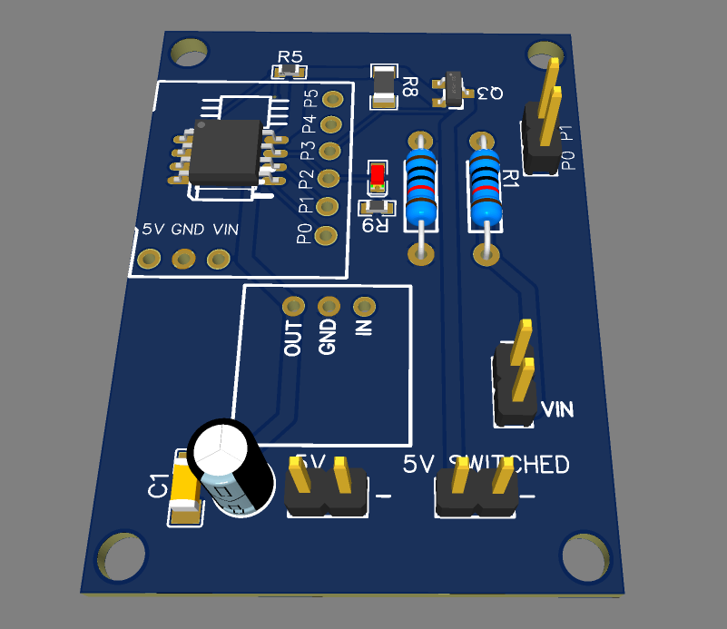
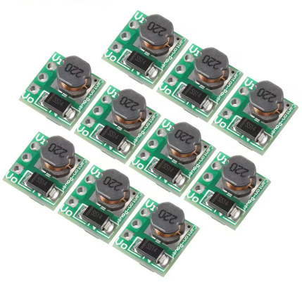
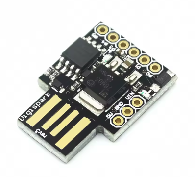
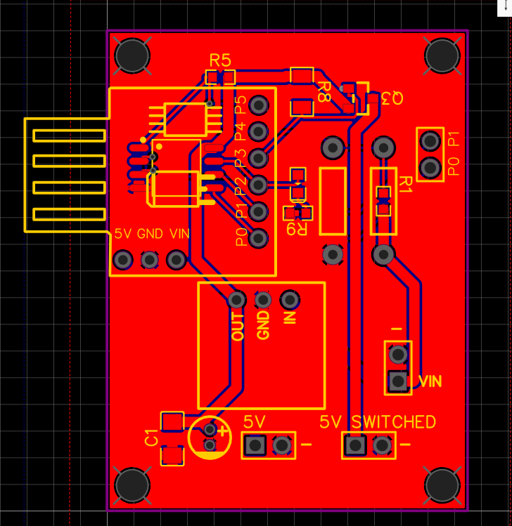
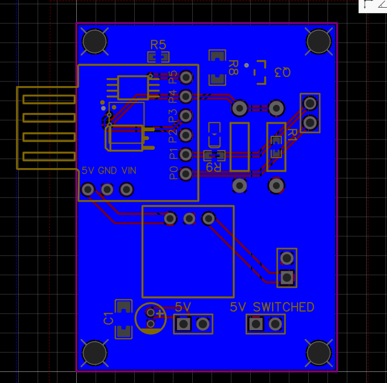
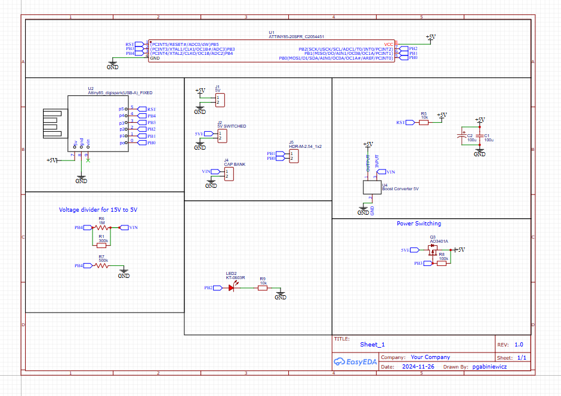

# ATTiny85-Power-Controller

## Hardware

Currently most of the board can be assembled by JLCPCB, only excluding the DCDC boost converter. Files for PCB and assembly are in the PCB folder.
You only need one filter capacitor, so choose between film or electrolytic. headers are optional.

You can choose between 3.0v, 3.3v or 5v DCDC converters, though it is recommended to use 3.3v so that you waste less power, can plug it into a batter port of a device and can set the cutoff voltage up to 3.3v.
Eg,
[**0.9-5V Boost**](https://vi.aliexpress.com/item/1005003932299815.html)

This board also is compatible with Digispark ATTiny85 boards, but you may have to set the fuses to run at 1MHz so the code runs correctly.
[DigiSpark ATTiny85](https://vi.aliexpress.com/item/2040316211.html)

## Firmware

You will need to use a Programmer like USBASP to flash the ATTiny85 chip.
Firmware can be built in Platformio using the platformio.ini and main.cpp files.

## Function

The board will shutdown at voltageMinimum and not send power to the switched line until the voltage climbs above voltageTarget.
When not outputting power on the switched line, the LED will blink every 8 sedonds when it wakes to check volage. Power consumption is about 0.5mA max in this state (normally lower than 0.1mA, I couldn't get reliable readings this low). 2mA when output is enabled and LED is continuously lit.

There are few customizable options at the top of the .cpp file that you can configure to your needs. The main 2 are voltageTarget and voltageMinimum for configuring resume and cutoff respectively.

- float calV = 1.0000;                              //calibration decimal value for 1.1Vref chip specific (lower value = higher voltage detected)
- int ADCSettleDelay = 1;                           //Time in ms to wait before performing conversion to allow VRef to settle (minimum is around 50ns, 1ms should be more than enough)
- int blinkDelay = 20;                              //blink duration in addition to about 4ms of ADC polling
- float dividerMultiplier = 1;                      //multiplier for resistor voltage divider
- int voltageTarget = 2500;                         //the target voltage to charge cap bank
- int voltageMinimum = 1000;                        //the target voltage to charge cap bank

